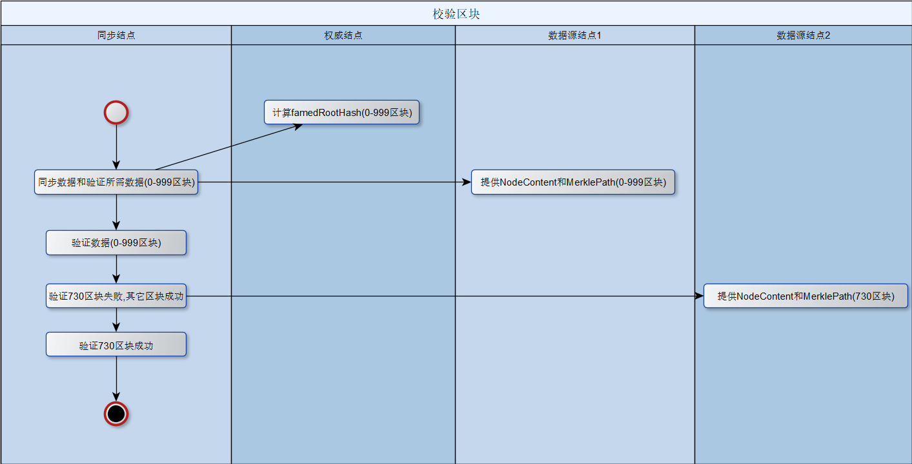

#  InterValue使用Merkle tree来验证区块是否被篡改


## Merkle tree


   通常来讲，首先对数据块进行hash化(例如：使用sha256就会使不同大小的块变为256定长),而后对相邻的两个hash结果进行拼接，再进行hash，这样操作直到只有一个顶层hash。当然，有一种特殊情况：如果数据块数量为奇数(如果图上还有L5的话)，就可以增加一个L5来进行计算(图上就变为L1,L2,L3,L4,L5,L5进行配对)。

   Merkle tree现有的理论比较成熟，机制原理也较容易理解。问题在于它的应用场景的细节没有相关说明。另外由Java语言实现的，成熟的商业开源方案还处于凤毛麟角的状况。


## 业务需求
   最近，InterValue研发团队在进行一个快速同步功能(fast sync)，需要把共识结点的海量区块快速同步到新加入的结点，这里面有一个关键的任务是，需要同步区块的结点能主动发现其中有问题的区块并只需要重新下载有问题的区块（例如，如果有100个区块共同下载到同步结点，其中2个块有问题，只需要重新下载有问题的2个块，不需要全部重新下载,提高下载效率）,此外，下载的区块验证数据大小不能呈指数级上升。


## InterValue用Java语言实现标准的Merkle tree
源代码已经发布在：[github](https://github.com/intervalue/intervalue-2.0.0-mainnet-rtm/tree/master/localfullnode2/src/main/java/one/inve/localfullnode2/utilities/merkle "merkle tree")


## Merkle tree怎样应用到InterValue结点校验数据区块中
  有几个关键概念需要提前知晓：

* NodeContent：区块或者文件块被视为NodeContent,它提供两个关键功能：产生hash和比较功能。

* FamedRootHash：由权威结点计算自己的merkle tree的hash根。

* MerklePath：它由hash数组和index数组(它指定同位置hash里值是左值“l”还是右值“r”)组成。上图为例，L1的hash数组为{“hash0-1”，“hash1”}，L1的index数组为{“r”，“r”}。
  CalculatedRootHash:根据NodeContent和MerklePath计算出来的hash根，它会被用于与famedRootHash做比较。

  

  快速同步验证流程

  

## 过程伪码

``` java
public void validateSyncBlock() {
		INodeContent[] blocks = buildBlocks();
		INodeContent[] tamperedBlocks = buildTamperedBlocks();

		MerkleTree mt = MerkleTree.create(blocks);
		Node root = mt.getRoot();
		byte[] famedRootHash = root.getHash();// which is provided by 3rd famed host

		MerklePath mp = mt.getMerklePath(blocks[2]);
		INodeContent tamperedBlock = tamperedBlocks[2];
		INodeContent integralBlock = blocks[2];

		// ignore these processes:
		// .......serialize (famedRootHash,mp,tamperedBlock,integralBlock)
		// ..........................................network transmission
		// .....deserialize (famedRootHash,mp,tamperedBlock,integralBlock)

		if (!mp.validate(tamperedBlock, famedRootHash)) {
			System.out.println("bad news 1: tampered item");// this would be displayed.
		}

		if (!mp.validate(integralBlock, famedRootHash)) {
			System.out.println("bad news 2: tampered item");// this wouldn't be displayed.
		}
	}

```

```java
	protected INodeContent[] buildBlocks() {
		INodeContent[] blocks = new INodeContent[3];

		blocks[0] = new Block("hello", 1);
		blocks[1] = new Block("blockchain", 2);
		blocks[2] = new Block("world", 3);

		return blocks;
	}

```

```java
	protected INodeContent[] buildTamperedBlocks() {
		INodeContent[] blocks = new INodeContent[3];

		blocks[0] = new Block("hello", 1);
		blocks[1] = new Block("blockchain", 2);
		blocks[2] = new Block("worlds", 3);// tampered item

		return blocks;
	}

```

## 作者简介

Francis.Deng（francis_xiiiv@163.com）,InterValue区块链架构师和项目源码的主要贡献者之一。