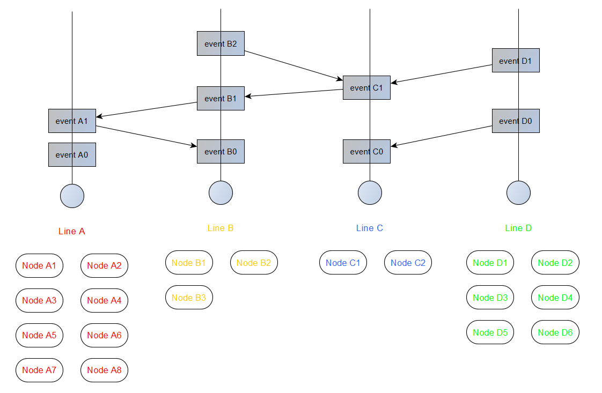
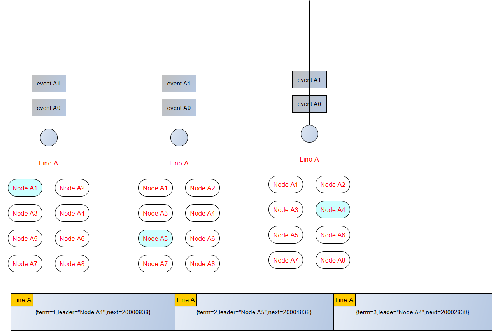
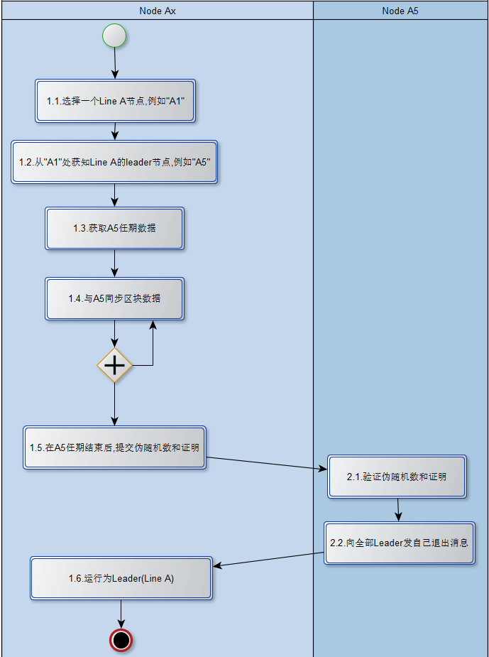
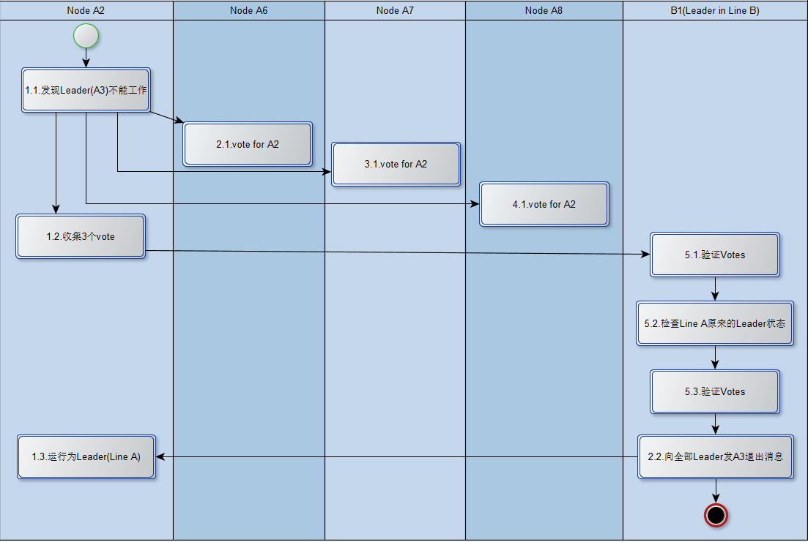

# InterValue节点间竞争记账权的机制

## 关键参与对象介绍

Event，它与传统区块链中的“区块”很类似，里面包括了最重要的交易列表，不同部分是，它有两个父Event,一个是在自己的Line上，另外一个可能在其它的Line上。有一种特殊的情况，在一开始的时候，它可能没有任何父Event。

Line，每一个Event需要归属到一根Line上，例如：Line A上就有“event A0”和“event A1”。此外，所有参与的节点需要分配它服务与哪根Line上，例如：节点C1和节点C2就服务于“Line C”。

Node，也即是共识节点，可以理解为一个进程或者一台主机用来参与系统的共识工作。

Seed，所有共识节点的管理节点，它负责给节点分配关键分片信息（这些随后被用于加入分片的过程）和需要服务的Line，如“Line A”。

## Line的重要性

Line是InterValue区块链DAG的核心对象之一，我们在此基础之上应用“先同步后共识”机制配合异步Hashnet算法来完成共识，Hashnet算法有一个关键的前提就是一定要固定下Line的条数。Line的条数必须在InterValue创世初期指定好，以后再不能改变。

## 竞争记账权的协议

### 节点角色和节点分工

在一根Line内的节点有两种角色：Leader和Follower。在一根Line内只能有一个Leader节点运行,同时伴随着多个Follower节点。Leader结点在Line内获得唯一记账权，它与其它Line内的Leader结点共同完成Hashnet共识。而Follower节点在Leader的任期内不参与共识，仅仅与Leader节点保持区块数据同步，在Leader节点任期届满后，参与新的Leader节点竞争。

在term=1任期内，节点A1是Line A唯一的Leader，而Line内的其它节点都是Follower。
在term=2任期内，节点A5竞争成为Leader，而Line内的其它节点都是Follower。
在term=3任期内，节点A4竞争成为Leader，而Line内的其它节点都是Follower。

### 新节点加入到成为Leader过程

这里假设：在这个任期内，节点A5是处在Leader角色。节点Ax为一个全新加入的结点，当然就没有任何区块数据并需要获取Line内的信息。

从“1.1”到“1.4”步骤为节点Ax获取全部区块的过程，来保证从节点A5拿到最新的数据这也是参与Leader竞争的前提条件。

在节点A5需要结束任期时（从1.5开始，这并不意味着它就完全退出Leader，它需要参与后面的验证工作和发布新Leader工作），全部的Follower需要计算自己的伪随机数和证明并提交Leader(本例也就是节点A5)进行验证，最终，节点leader会选择符合条件的节点，并把结果（伪随机数和证明）和新Leader信息通知全部Leader,这样Leader角色完成更替。

### Leader节点任期内异常处理机制

这里举例一个场景：节点A3是任期内的Leader节点，A1,A2,A4,A5,A6,A7,A8为Follower节点，B1为另外一根Line B的Leader节点，在这里忽略选择B1的细节。

当A2发现Line A内的Leader结点A3不能正常工作（可能是p2p协议里找不到或者不能执行同步数据功能），它抢先向A6,A7,A8发出投票要求(所谓抢先是指，当它们收到投票要求后，即使它也发现A3不能正常工作，也不能再发出投票要求，只能认同或者不认同其它人的投票要求，因为它比A2反应慢)。

当A6,A7和A8确认A3不能正常工作,它们会给A2返回Yes和签名数据。节点A2收集到三个投票后，把请求发给B1(另外Line的Leader节点)。B1只会处理同时处理一个这种请求，检查原有A3的状态，检查三张投票，如果验证通过则向全部Leader发A3退出消息，在这之后A2就运行为Leader节点。

## 作者介绍

**Francis.Deng**（francis_xiiiv@163.com）,InterValue区块链架构师和项目源码的主要贡献者之一。